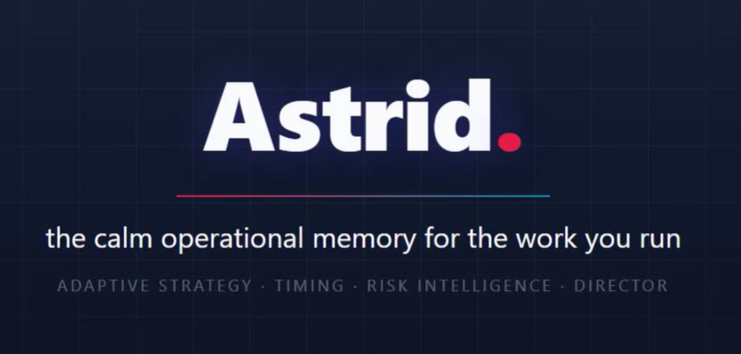

<p align="center">
  <a href="https://youtu.be/hMdUBDRynO8" title="Meet Astrid — watch the intro (2:40)"></a>
</p>

<p align="center">
  
</p>

<p align="center">
  <a href="https://youtu.be/hMdUBDRynO8"><strong>▶ Meet Astrid</strong></a> (2:40, YouTube&nbsp;↗)
  &nbsp;·&nbsp;
  <a href="https://youtu.be/Hv_I9FLQ6gA"><strong>Watch the explainer</strong></a> (1:40, YouTube&nbsp;↗)
</p>

<p align="center">
  <a href="https://youtu.be/Hv_I9FLQ6gA"></a>
</p>

---

# Astrid — your project assistant

**Astrid keeps the truth of your projects in one place.** Every commitment, decision, blocker, and thing-to-watch becomes a small, durable card. Astrid reads those cards before it says anything, surfaces what's late or blocked, and turns the things you mention in passing into tracked work before they fall through a crack. Then it renders the whole portfolio as a dashboard you can open in a browser.

It is built on three operational cards — **project-card**, **action-card**, **meeting-card** — plus a supporting **contact-card**, and a few small scripts that index the cards and build the dashboard. No database, no SaaS, no account. Just JSON files you own, in a folder, that a Claude project reads.

> Astrid is the *operational* half of a card-based methodology. Its companion **Miles** (the meeting reflection coach) is the *reflective* half. They share the same data model — see [Companions](#companions).

> [!IMPORTANT]
> **The UI here is deliberately minimal — by design.** The only interface that ships is `dashboard.html`: a single, read-only reference view. The product is the *data model* — durable JSON cards you own — not a front-end. The dashboard exists to prove the cards work and to give you something to look at on day one; it is **not** meant to be the way you view or edit your work.
>
> So this is an open invitation: **build your own UI on top of the cards.** A web app, a TUI, a mobile view, an editor that creates and edits cards, a sync to Notion or Obsidian — anything that reads and writes the schemas in `reference/schemas/`. The schemas are the contract; `dashboard.html` is just one renderer. If you build something, please share it back — see [CONTRIBUTING](CONTRIBUTING.md).

---

## Get started in 5 minutes

1. Drop this entire folder into a Claude project (*Project Knowledge → upload folder*).
2. *(Optional but recommended)* Drop the `sample-workspace/` folder in too — it's a worked fictional project (Acme Logistics, a cloud migration) so you can see the system fully populated before writing your own data. Open `sample-workspace/_index/dashboard.html` in a browser right now to see what you're building toward.
3. Open a new chat and say: *"Let's set up my projects."* Astrid runs the [onboarding interview](onboarding.md) — who you are, what you're working on, how you like to work, and where your email lives. Twenty minutes later you have your real portfolio on a dashboard.

Every session after that starts the same way: Astrid reads your cards and tells you where things stand.

## What's in the folder

```
astrid/
├── README.md                ← you are here
├── identity.md              ← who Astrid is
├── spirit.md                ← Astrid's strategic character (collaborative, non-manipulative)
├── rules.md                 ← how Astrid operates (the discipline)
├── onboarding.md            ← the first-session interview
├── methodology.md           ← the light project method, explained
├── examples.md              ← three worked sessions, verbatim
├── scripts/
│   ├── rebuild-index.ps1        ← scan cards → JSON indexes + auto-flags
│   ├── generate-dashboard.ps1   ← indexes → self-contained dashboard.html
│   ├── generate-portal.ps1      ← indexes + documents → navigable project portal
│   ├── new-project.ps1          ← scaffold a new project's folders + starter project.json
│   ├── intake-scaffold.ps1      ← an intake.json → project + deliverable/risk/milestone cards
│   ├── render-doc-pdfs.ps1      ← (optional, Windows) render docx/xlsx → PDF for inline viewing
│   └── validate-cards.ps1       ← check cards against the schema
└── reference/
    ├── data-model.md            ← the cards, one graph
    ├── cynefin.md               ← matching your approach to the kind of situation
    ├── steering-report.md       ← how Astrid reports across the portfolio + flags stagnation
    └── schemas/                 ← JSON schemas for every card type
```

Three operational cards carry most work — **project**, **action**, **meeting** (+ the supporting **contact**). Five more are there when a project earns the structure: **issue**, **risk**, **decision**, **milestone**, **deliverable**. They all link their work down into action-cards. See [reference/data-model.md](reference/data-model.md) and [methodology.md](methodology.md) — and reach for them deliberately, not by default.

Separate from the assistant folder, the optional **`sample-workspace/`** ships a fully worked project so you (and anyone reviewing this) can see the system in motion:

```
sample-workspace/
├── _preferences.md              ← how "you" (Sarah Chen) like to work
├── _contacts/                   ← the people, by id
├── projects/ACME/cloud-migration/
│   ├── project.json             ← the project anchor
│   ├── cards/                   ← 6 action-cards (task, decision, monitoring, blocker)
│   ├── meetings/                ← a meeting-card (the factual layer)
│   ├── risks/ decisions/ issues/ milestones/ deliverables/   ← one of each extended card
└── _index/                      ← pre-generated dashboard.html + indexes
```

## The tooling

The cards are plain files you can edit by hand or with Astrid. A few small PowerShell scripts turn them into live views and scaffold new work.

**Prerequisite:** PowerShell 7+ (`pwsh`) — free and cross-platform (Windows/macOS/Linux). That's the only requirement. Node.js + `ajv-cli` are optional, used solely for stricter JSON-Schema validation; without them `validate-cards.ps1` runs dependency-free light checks.

```powershell
# from your workspace root:
pwsh -File path/to/scripts/rebuild-index.ps1 -Root .
pwsh -File path/to/scripts/generate-dashboard.ps1 -Root . -Open
```

`rebuild-index.ps1` recomputes the `late`/`urgent` flags and writes the JSON indexes. `generate-dashboard.ps1` builds a single self-contained `dashboard.html` — projects as cards, click into a project for Urgent / In progress / Waiting columns, click a card for its full detail, body, and activity log. Optional `-IssueBase`/`-WikiBase` parameters deep-link your source refs into your tracker or wiki.

`generate-portal.ps1` builds a second, navigable view — **`portal.html`**: each project gets a phase header (read from its status) and tabs for **Actions, Risks, Deliverables, Documents**, where a risk's mitigating actions and a deliverable's actions click through to the card that carries them. Drop a `documents/` folder in a project and its files appear in the Documents tab — PDF, HTML, PNG and Markdown render **inline**; Office files render inline once `render-doc-pdfs.ps1` (optional, Windows + Office) converts them to PDF.

Starting a project is two scripts, not hand-written JSON. `new-project.ps1` scaffolds the folders and a valid starter `project.json`; `intake-scaffold.ps1` turns a small `intake.json` — customer, scope, stakeholders, and the deliverables/risks/milestones you already know — into a populated project, a schema-valid card for each, inventing nothing. See [`scripts/intake.example.json`](scripts/intake.example.json).

## A question worth answering: your email

Most commitments are born in email. *"Send me the runbook by Friday." "We've decided on the phased approach." "Still waiting on your sign-off."* Each is a card waiting to be captured — and today you capture them by remembering to.

So onboarding asks one question that decides how much Astrid can do for you:

> **Where does your email live — Outlook, Gmail, IMAP, something else — and do you want to wire it in?**

A small **MCP server** for your mailbox lets Astrid read the relevant mail and turn a thread into the right card — task, decision, or blocker — with the owner and deadline already filled in and the source linked back. The inbox stops being a second to-do list you mentally reconcile against this one. It's entirely optional; the card system works fully without it. But if email is where your work actually arrives, it's the highest-leverage thing you can add. See [onboarding.md](onboarding.md) §5.

## Companions

Astrid is one building block in a card-based methodology. Companions share the same data model — the same `project.json`, the same contact-cards, the same `meetings/` folder — so they compose without integration work.

- **Miles — the meeting reflection coach.** Astrid records *that* a meeting happened and what work it produced. Miles works on *how you ran it*: anchored strengths, growth moments, and a Socratic mirror, tracked longitudinally. They read the same meeting-card — Astrid owns the factual layer, Miles owns the reflection layer. When you want to get better at the room and not just track it, that's Miles.

## What you can build on this

Portfolio reporting and stagnation-spotting are **built in** (see [reference/steering-report.md](reference/steering-report.md)): every project carries a reporting cadence, the tooling flags when one is overdue and which actions have gone stale, and the dashboard shows it. Natural *extensions* on top: an email→card MCP bridge (above), more card types (a retro-card, a weeknote snapshot), specialist personas that read the same data (a stakeholder-comms drafter, a risk reviewer), richer dashboard views (a risk matrix, a milestone timeline), and recurring automations (a scheduled Monday portfolio sweep). The data model is deliberately open so these all plug in.

## License

MIT — see [LICENSE](LICENSE).

## Provenance

Built on the folder-based specialist methodology. Part of a card-based portfolio of project-work companions; designed to interoperate with **Miles**, the meeting reflection coach.
